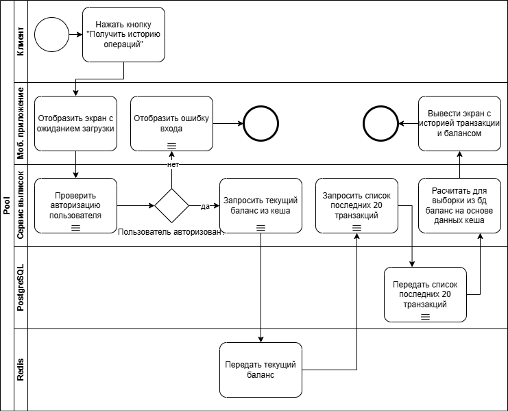
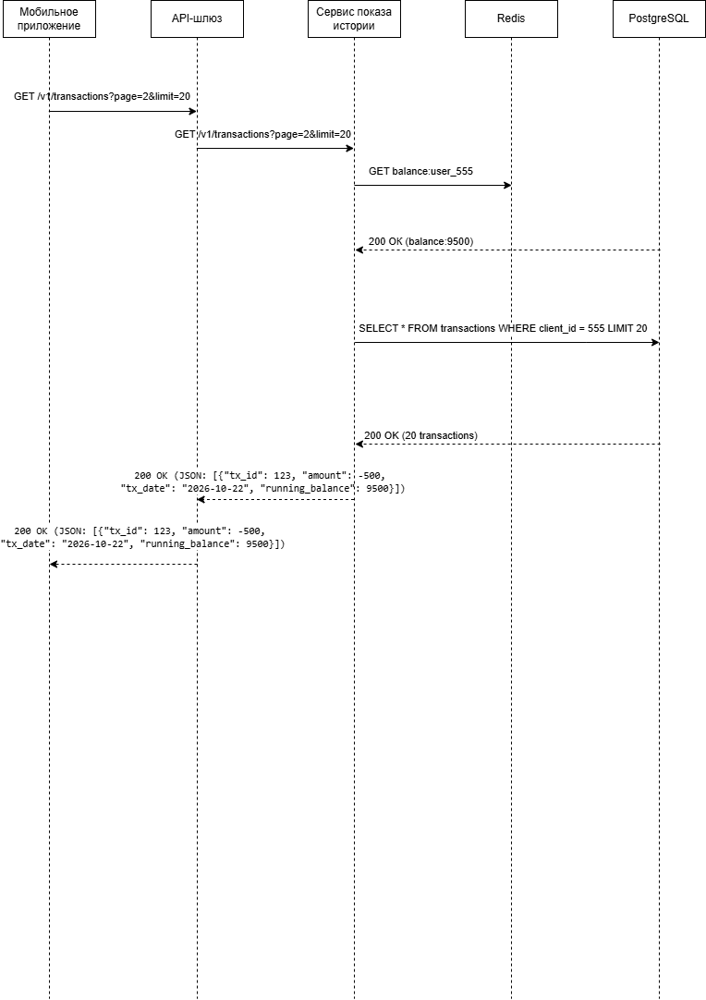
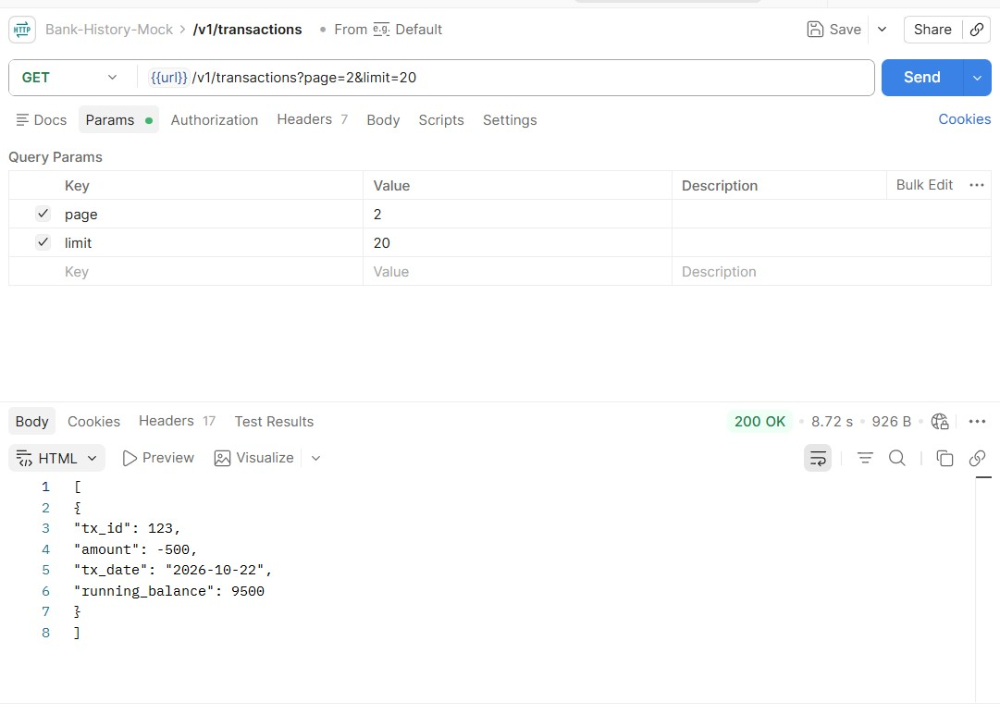

# Проект: Проектирование высоконагруженного сервиса постраничной истории операций (Выписка по счету)

## 1. Бизнес-контекст и формулировка задачи

**Бизнес-проблема:** В мобильном банке при открытии экрана «История операций» система совершала прямой тяжелый запрос к монолитной базе данных PostgreSQL, пытаясь выгрузить все транзакции клиента за несколько лет и рассчитать баланс нарастающим итогом на лету. Для клиентов с большим количеством операций (от 10 000 транзакций) это приводило к таймаутам (`504 Gateway Timeout`), критической нагрузке на СУБД и зависанию интерфейса приложения.

**Постановка задачи:** Спроектировать изолированный высоконагруженный микросервис истории операций с поддержкой постраничной пагинации и гарантией времени отклика системы < 200 мс при высокой доступности (Highload, SLA 99.99%).

**Архитектурные решения проекта:**
1. **Database per Service:** Выделение изолированной СУБД PostgreSQL под историю операций с применением партиционирования (секционирования) таблицы по диапазонам ID клиентов.
2. **Постраничная пагинация (Pagination):** Ограничение выдачи объема данных порциями (лимит — 20 записей за один запрос).
3. **Кэширование актуального баланса (Redis):** Использование быстрого хранилища Key-Value в оперативной памяти для фиксации стартовой точки баланса клиента. Это исключает необходимость сканирования миллионов строк в PostgreSQL для расчета нарастающего итога.
4. **Оптимизация расчета баланса (Оконные функции SQL):** Расчет баланса в обратную сторону от текущей точки кэша Redis на лету, затрагивающий только 20 строк из пагинации.

---

## 2. Моделирование бизнес-процесса (BPMN 2.0)

Сквозная логика работы микросервиса, включающая проверку авторизации пользователя (Негативный сценарий / Unhappy Path), кэширование и правила безопасного извлечения данных из СУБД:



---

## 3. Сценарий технического взаимодействия систем (UML Sequence)

Технический алгоритм каскадного обмена данными во времени. Для обеспечения 100% консистентности данных микросервис сначала фиксирует точку отсчета в Redis, а затем выгружает порцию транзакций из СУБД:



---

## 4. Проектирование спецификаций REST API (OpenAPI / Swagger)

Контракт взаимодействия между Мобильным приложением и API-шлюзом бэкенда для постраничного чтения истории операций.

```yaml
paths:
  /v1/transactions:
    get:
      summary: Получение постраничной истории операций клиента с расчетом баланса
      description: Возвращает массив из 20 транзакций для указанной страницы с расчетом нарастающего итога
      parameters:
        - name: page
          in: query
          description: Номер запрашиваемой страницы выписки
          required: true
          schema:
            type: integer
        - name: limit
          in: query
          description: Количество транзакций на одну страницу (по умолчанию 20)
          required: true
          schema:
            type: integer
      responses:
        '200':
          description: Успешное получение порции данных истории операций
          content:
            application/json:
              schema:
                type: array
                items:
                  type: object
                  properties:
                    tx_id:
                      type: integer
                    amount:
                      type: integer
                    tx_date:
                      type: string
                    running_balance:
                      type: integer
```

---

## 5. Проектирование логики работы с БД (SQL-скрипты)

Высокоэффективный SQL-запрос для расчета баланса нарастающим итогом в режиме реального времени. Вместо сканирования всей истории за несколько лет, запрос вычитает суммы операций из актуального значения кэша Redis (в примере: `9500`) в обратном порядке времени (`ORDER BY tx_date DESC`) в рамках переданного лимита.

```sql
SELECT 
    tx_id, 
    amount, 
    tx_date,
    (9500 - SUM(amount) OVER(PARTITION BY client_id ORDER BY tx_date DESC)) as running_balance
FROM transactions 
WHERE client_id = 555;
```

---

## 6. Верификация и тестирование контракта API (Postman Mock Server)

Результат успешного имитационного тестирования разработанного REST-эндпоинта выписки в среде Postman с использованием Mock-сервера. Проверена корректность раскладки Query-параметров пагинации (`page=2`, `limit=20`) и валидность структуры результирующего JSON-массива с кодом ответа `200 OK`:


