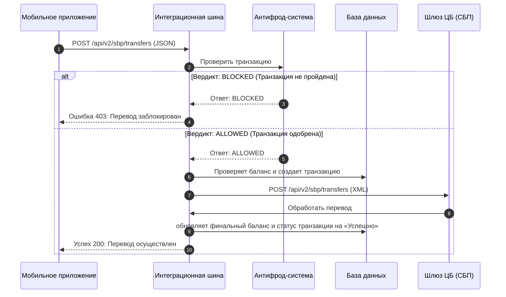

# Проект: Проектирование модуля мгновенных межбанковских переводов по номеру телефона (Интеграция с СБП)

## 1. Бизнес-контекст и формулировка задачи

**Бизнес-проблема:** 
Текущая архитектура банка поддерживает переводы между физическими лицами только внутри собственного контура или по номеру карты (с высокой комиссией и длительным сроком зачисления через сторонние платежные системы). Это приводит к оттоку активных клиентов в банки-конкуренты, снижению показателя удержания пользователей (Retention Rate) и потере доли транзакционного дохода.

**Постановка задачи (Пожелание заказчика):**
Необходимо спроектировать и внедрить в мобильное приложение банка функционал мгновенных межбанковских переводов по номеру телефона через государственную Систему Быстрых Платежей (ОПКЦ СБП Центрального Банка). 

**Бизнес-цели проекта:**
1. Предоставить клиентам возможность осуществлять мгновенные переводы (зачисление < 15 секунд) в любые банки-участники СБП без комиссии (в пределах установленных ЦБ лимитов).
2. Снизить риск финансовых потерь банка от мошеннических операций (фрода) при межбанковских переводах до уровня < 0.01% от общего объема транзакций.
3. Обеспечить сквозную автоматизацию процесса (STP — Straight-Through Processing) без привлечения ручной модерации со стороны сотрудников бэк-офиса банка.

**Границы проектирования (In Scope):**
* Разработка интерфейсного сценария (Use Case) для мобильного приложения.
* Проектирование сквозного асинхронного бизнес-процесса (BPMN) и технического взаимодействия систем во времени (UML Sequence).
* Разработка контрактов интеграции: REST API (JSON) для клиентского приложения и SOAP (XML) по стандарту ISO 20022 для взаимодействия со шлюзом Центрального Банка.
* Проектирование реляционной структуры хранения данных (ERD) и логики валидации баланса/статусов (SQL).

---

## 2. Моделирование бизнес-процесса (BPMN 2.0)

Сквозная логика прохождения платежа, валидации лимитов и межбанковского взаимодействия с разделением зон ответственности систем:


---

## 3. Сценарий взаимодействия систем (UML Sequence Diagram)

Технический алгоритм обмена данными, вызова внутренних систем (Антифрод, БД) и интеграции с внешним шлюзом ЦБ во времени:



---

## 4. Жизненный цикл транзакции (UML State Machine Diagram)

Карта переходов статусов сущности «Транзакция» в базе данных на протяжении всего процесса обработки перевода:


---

## 5. Проектирование спецификаций API (Спецификации контрактов)

### 5.1. Внешний контур (App -> ESB) — REST API (JSON)
**Метод:** `POST`  
**Эндпоинт:** `/api/v2/sbp/transfers`  
**Тело запроса:**

```json
{
  "source_account_id": 123,
  "receiver_phone": "+79092341123",
  "amount": 1243,
  "receiver_bank": "Сбербанк"
}
```

### 5.2. Внутренний контур (ESB -> Шлюз СБП ЦБ) — SOAP (XML ISO 20022)
**Метод:** `POST`  
**Тело запроса:**

```xml
<SbpTransferRequest>
    <source_account_id>123</source_account_id>
    <receiver_phone>+79092341123</receiver_phone>
    <amount>1243</amount>
    <receiver_bank>Сбербанк</receiver_bank>
</SbpTransferRequest>
```

---

## 6. Проектирование логики работы с БД (SQL-скрипты)

### 6.1. Оптимизированная проверка баланса отправителя (перед холдированием средств)
```sql
SELECT EXISTS (
    SELECT 1 
    FROM accounts 
    WHERE id = 123 AND balance >= 1243
);
```

### 6.2. Обновление статуса транзакции до успешного после подтверждения от ОПКЦ СБП
```sql
UPDATE transactions 
SET status = 'SUCCESS' 
WHERE id = 555;
```

---

## 7. Верификация и тестирование API контракта (Postman)

Результат успешного ручного тестирования разработанного REST-эндпоинта перевода в среде Postman (проверка корректности структуры JSON и получения ответа `200 OK` от сервера):


