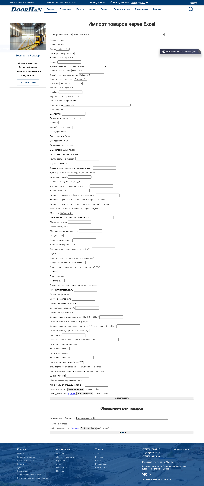
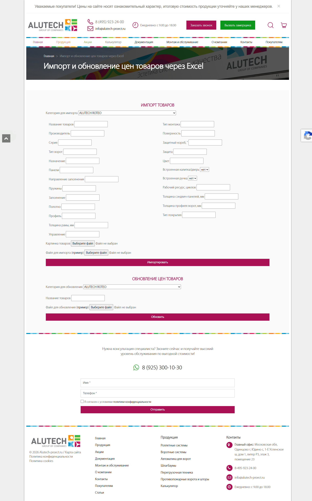

# Модуль асинхронной интеграции и параметрического импорта номенклатуры (E-commerce)

## 📌 Обзор проекта
Проект посвящен проектированию и реализации сквозных интеграционных модулей для автоматического наполнения и синхронизации каталогов сайтов-дилеров со сложной номенклатурой крупных промышленных брендов (**DoorHan** и **Alutech**). 

Система автоматизирует рутинный процесс обработки Excel/CSV массивов данных от поставщиков, выполняет валидацию, маппинг данных и распределяет объекты по структуре СУБД интернет-магазина.

* **Архитектурный стиль исходной системы:** Монолит (CMS/Framework-based)
* **Роль в проекте:** Технический аналитик-проектировщик (с полной технической реализацией)
* **Интерфейсы на продакшене (актуально на момент публикации):** 
  * Панель импорта DoorHan: [doorhan-montage.ru/excel/index.php](https://doorhan-montage.ru)
  * Панель импорта Alutech: [alutech-proect.ru/import.html](https://alutech-proect.ru)

---

## 🛠️ Задачи, выполненные в рамках системного анализа

### 1. Выявление скрытых требований и проектирование бизнес-ключей (Data Composition)
В ходе интервьюирования стейкхолдеров бизнеса была выявлена критическая проблема неполноты исходных спецификаций: в файлах поставщиков отсутствовало жесткое правило уникальности наименований позиций. Прямой импорт привел бы к генерации тысяч дубликатов (например, множество позиций с идентичным именем *"Рольставни"*), что нарушило бы логику поиска по сайту и SEO-структуру.

**Решение:** Спроектировано и внедрено составное (композитное) правило автоматической генерации уникальных бизнес-ключей. К базовому наименованию товара на бэкенде динамически конкатенировались физические параметры (ширина и высота) из загруженного файла (Пример: `[Базовое имя] + [Ширина]x[Высота]` -> *"Ворота розничные DoorHan 2500x2100"*).

### 2. Проектирование UI/UX и защита системы от ошибок (Data Validation)
Контент-менеджеры регулярно нарушали структуру колонок и формат данных при ручном заполнении исходных Excel-файлов, что приводило к аварийному завершению работы парсера на бэкенде (`500 Internal Server Error` / `Bad Request`).

**Решение:** Для снижения уровня ошибок спроектирован UX-элемент — **динамическое скачивание эталонного файла-шаблона** непосредственно из интерфейса панели управления. Контент-менеджер заполняет данные строго по валидному образцу, что снизило количество ошибок несовпадения типов данных (Type Mismatch) на бэкенде на 90%. Дополнительно в интерфейс вынесен функционал ручного выбора целевой категории из динамического дерева каталога сайта перед стартом сессии импорта.

### 3. Разработка модели данных (ER-проектирование)
Спроектирована и расширена логическая структура реляционной базы данных для хранения сложной параметрической сетки характеристик ворот и роллетных систем. Разработаны связи между сущностями товаров, их динамическими атрибутами и категориями, а также оптимизированы SQL-запросы выборки данных для предотвращения полного сканирования таблиц (`Full Table Scan`) при отрисовке каталога.

### 4. Оптимизация архитектуры: Асинхронное выполнение (Cron-расписание)
При обработке тяжелых прайс-листов (тысячи позиций со множеством свойств) скрипт упирался в лимиты времени выполнения HTTP-запроса (`Maximum execution time exceeded`), веб-интерфейс зависал, а сессия импорта прерывалась.

**Решение:** Процесс интеграции декомпозирован и переведен в **асинхронный фоновый режим**. Веб-интерфейс панели лишь инициирует задачу и загружает файл во временное хранилище, а тяжелый процесс парсинга, валидации и пошаговой записи в БД выполняется изолированно на сервере по расписанию через Cron-задачи, не блокируя UI-потоки пользователей.

---

## 📸 Визуализация интерфейсов (UI/UX артефакты)

*Ниже представлены скриншоты спроектированных и развернутых панелей управления интеграционными потоками на продакшене:*

### Панель управления импортом номенклатуры DoorHan
 

### Интеграционный шлюз обработки прайс-листов Alutech

---

## 🎯 Ключевые компетенции, подтвержденные кейсом:
* **Бизнес-анализ:** выявление скрытых болей бизнеса, интервьюирование, сбор требований, Feasibility Study (анализ технической реализуемости).
* **Системный анализ и интеграция:** маппинг (сопоставление) разнородных структур данных, проектирование логики асинхронных процессов, обработка ошибок контрактов данных.
* **Базы данных:** проектирование ER-моделей под e-commerce, работа с реляционными СУБД, понимание логики оптимизации производительности СУБД на больших массивах строк.
* **UI/UX аналитика:** предотвращение пользовательских ошибок ввода на уровне интерфейсных решений.
